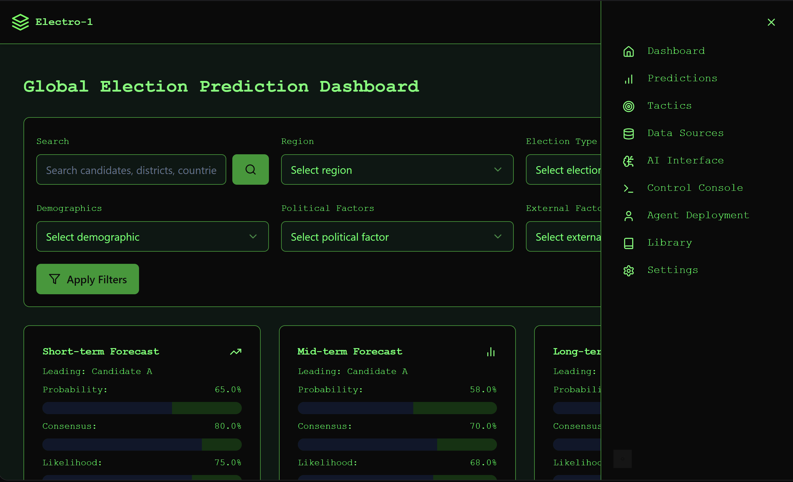

# Agentic Election Prediction System
What if you could predict every election on individual level for the entire world, in real time.

[](https://electo1-js.gptengineer.run/)


## Introduction

The Agentic Election Prediction System is an innovative platform designed to accurately forecast election outcomes using an agentic approach. It leverages multiple independent agents to process and analyze complex datasets, providing high-precision forecasts and insights.

## Features

- High-Precision Forecasting
- Agentic Collaboration
- Real-Time Data Integration
- Scalability and Modularity
- Dynamic Parameter Optimization
- Advanced Language Model Integration
- Civic Engagement Tactics Management

## API Overview

### Endpoints

- Predictions: CRUD operations for election predictions
- Data Sources: Manage various data sources
- Agent Deployment: Configure and manage prediction agents
- Library: Manage reusable components and templates
- Settings: System-wide configuration
- Tactics: Manage civic engagement tactics

For detailed API documentation, please refer to the [API Reference](documentation/api_reference.md) file.

## Installation and Setup

### Prerequisites

Before you begin, ensure you have the following installed on your machine:
- Python 3.11 or higher
- Poetry for dependency management

### Installation Steps

1. **Clone the repository**:
   ```sh
   git clone https://github.com/ruvnet/Electo1.git
   cd Electo1
   ```

2. **Install dependencies**:
   ```sh
   poetry install
   ```

3. **Run the application**:
   ```sh
   poetry run uvicorn api.main:app --reload
   ```

## Usage Overview

The Agentic Election Prediction System is designed to be user-friendly and efficient. Here is a detailed usage overview:

1. **Data Ingestion**: The system collects data from multiple sources, including polling data, social media trends, demographic information, and historical election results.
2. **Data Processing**: The ingested data is cleaned, normalized, and preprocessed to ensure consistency and accuracy.
3. **Prediction Modeling**: The processed data is analyzed using machine learning algorithms and language models to generate predictions.
4. **Result Aggregation**: The outputs from various agents are combined to produce a cohesive and accurate election forecast.
5. **API Interaction**: The system provides accessible endpoints for external applications to interact with the prediction system.

## Architecture Overview

The architecture of the Agentic Election Prediction System is designed to be modular and scalable. It consists of the following components:

1. **Agents**: Independent agents responsible for specific tasks such as data ingestion, data processing, analysis, prediction, and optimization.
2. **Data Storage**: A structured storage system to store raw, processed, and external data.
3. **Machine Learning Models**: Advanced machine learning models used for prediction and analysis.
4. **API Layer**: A FastAPI application that provides endpoints for interacting with the system.
5. **Frontend**: A user-friendly interface for visualizing predictions and interacting with the system.

## Detailed Overview of the `/fastapi` Directory and Its Endpoints

The `/fastapi` directory contains the core components of the Agentic Election Prediction System. Here is a detailed overview of its structure and endpoints:

### Directory Structure

```
fastapi/
├── agents/
│   ├── analysis.py
│   ├── data_ingestion.py
│   ├── data_processing.py
│   ├── optimization.py
│   └── prediction.py
├── api/
│   ├── crud.py
│   ├── database.py
│   ├── dependencies.py
│   ├── main.py
│   ├── models.py
│   ├── routers/
│   │   ├── agent_deployment.py
│   │   ├── data_sources.py
│   │   ├── library.py
│   │   ├── predictions.py
│   │   ├── settings.py
│   │   └── tactics.py
│   └── schemas.py
├── data_handler.py
├── documentation/
│   ├── advanced_uses.md
│   ├── algorithms.md
│   ├── api_reference.md
│   ├── customization.md
│   ├── dev_guide.md
│   └── user_guide.md
├── election_model.joblib
├── event_bus/
│   └── event_bus.py
├── main.py
├── ml/
│   └── model.py
├── model.py
├── Pasted--Overview-The-Agentic-Election-Prediction-System-is-designed-to-forecast-election-outcomes-by-1726958739944.txt
├── pyproject.toml
├── README.md
├── replit.nix
├── static/
│   ├── css/
│   │   └── style.css
│   ├── index.html
│   ├── js/
│   │   └── script.js
│   └── script.js
├── templates/
│   └── index.html
├── test.db
├── tests/
│   ├── test_agents.py
│   ├── test_api.py
│   └── test_models.py
└── replit.nix
```

### Endpoints

- **Predictions**: 
  - `POST /api/predictions/`: Create a new prediction
  - `GET /api/predictions/`: List all predictions
  - `GET /api/predictions/{id}`: Get a specific prediction
  - `PUT /api/predictions/{id}`: Update a prediction
  - `DELETE /api/predictions/{id}`: Delete a prediction

- **Data Sources**: 
  - `POST /api/data_sources/`: Add a new data source
  - `GET /api/data_sources/`: List all data sources
  - `GET /api/data_sources/{id}`: Get a specific data source
  - `PUT /api/data_sources/{id}`: Update a data source
  - `DELETE /api/data_sources/{id}`: Delete a data source

- **Agent Deployment**: 
  - `POST /api/agent_deployment/`: Deploy a new agent
  - `GET /api/agent_deployment/`: List all deployed agents
  - `GET /api/agent_deployment/{id}`: Get a specific agent deployment
  - `PUT /api/agent_deployment/{id}`: Update an agent deployment
  - `DELETE /api/agent_deployment/{id}`: Remove an agent deployment

- **Library**: 
  - `POST /api/library/`: Add a new library item
  - `GET /api/library/`: List all library items
  - `GET /api/library/{id}`: Get a specific library item
  - `PUT /api/library/{id}`: Update a library item
  - `DELETE /api/library/{id}`: Delete a library item

- **Settings**: 
  - `POST /api/settings/`: Create a new setting
  - `GET /api/settings/`: List all settings
  - `GET /api/settings/{key}`: Get a specific setting
  - `PUT /api/settings/{key}`: Update a setting
  - `DELETE /api/settings/{key}`: Delete a setting

- **Tactics**: 
  - `POST /api/tactics/`: Create a new tactic
  - `GET /api/tactics/`: List all tactics
  - `GET /api/tactics/{id}`: Get a specific tactic
  - `PUT /api/tactics/{id}`: Update a tactic
  - `DELETE /api/tactics/{id}`: Delete a tactic

## Documentation

For more detailed information, please refer to the following documentation files:

- [API Reference](documentation/api_reference.md)
- [User Guide](documentation/user_guide.md)
- [Developer Guide](documentation/dev_guide.md)
- [Frontend Overview](documentation/frontend_overview.md)
